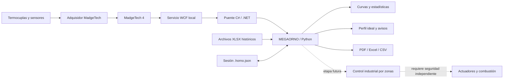
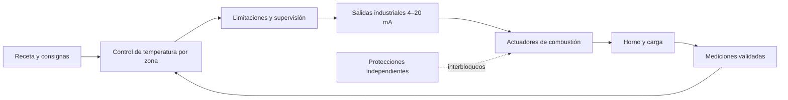

<div align="center">

# MEGAORNO

### Supervisión, adquisición y análisis de tratamientos térmicos en un horno industrial

**Ingeniería aplicada · Instrumentación · Software · Procesamiento de señales · Automatización industrial**


**[Código fuente v3.2](https://github.com/BaltazarPatane/MEGAORNO/tree/version/v3.2) · [Ver historial de versiones](#historial-de-desarrollo-y-versiones) · [Ver hoja de ruta](#trabajos-futuros-y-hoja-de-ruta)**

</div>

<!-- IMAGEN 01 / PORTADA
Insertar aquí una imagen panorámica del horno completo, preferentemente el recorte sin fondo construido a partir de ambas fotografías. Ruta sugerida: docs/img/01-horno-completo.png
Cuando la fotografía esté subida al repositorio, reemplazar este comentario por:

-->

> **Estado del proyecto al 8 de octubre de 2026.** MEGAORNO es una aplicación en desarrollo para registrar, visualizar e interpretar el comportamiento térmico de un horno industrial. Integra datos de termocuplas adquiridos con instrumental MadgeTech, los compara con un perfil ideal de tratamiento, calcula velocidades de calentamiento y enfriamiento, conserva el historial del proceso y permite elaborar informes en PDF, Excel y CSV. La automatización directa de quemadores y actuadores constituye una **etapa futura**; el visor no debe interpretarse como un controlador de seguridad ni como un sistema de lazo cerrado ya validado.

## Índice

1. [Presentación del proyecto](#presentación-del-proyecto)
2. [El horno industrial y su potencial](#el-horno-industrial-y-su-potencial)
3. [Origen del proyecto y relevamiento de requerimientos](#origen-del-proyecto-y-relevamiento-de-requerimientos)
4. [Objetivos, alcance y estado de avance](#objetivos-alcance-y-estado-de-avance)
5. [Arquitectura del sistema](#arquitectura-del-sistema)
6. [Instrumentación y adquisición de temperatura](#instrumentación-y-adquisición-de-temperatura)
7. [Fundamentos físicos y matemáticos](#fundamentos-físicos-y-matemáticos)
8. [Perfil ideal y evaluación del tratamiento](#perfil-ideal-y-evaluación-del-tratamiento)
9. [Interfaz y descripción de sus pestañas](#interfaz-y-descripción-de-sus-pestañas)
10. [Almacenamiento, exportaciones e informes](#almacenamiento-exportaciones-e-informes)
11. [Historial de desarrollo y versiones](#historial-de-desarrollo-y-versiones)
12. [Validaciones y diagnóstico](#validaciones-y-diagnóstico)
13. [Instalación y uso](#instalación-y-uso)
14. [Trabajos futuros y hoja de ruta](#trabajos-futuros-y-hoja-de-ruta)
15. [Seguridad y limitaciones](#seguridad-y-limitaciones)
16. [Galería y ubicaciones de imágenes](#galería-y-ubicaciones-de-imágenes)
17. [Referencias técnicas y autoría](#referencias-técnicas-y-autoría)

---

## Presentación del proyecto

**MEGAORNO** surge de la necesidad de modernizar la adquisición, visualización, seguimiento y documentación de los ciclos de tratamiento térmico de un horno industrial de gran escala, en el contexto de las actividades del **Área de Investigación y Desarrollo de Astillero Río Santiago**.

El proyecto aborda conjuntamente problemas de instrumentación, trazabilidad de datos, análisis térmico, interacción persona-máquina y futuras estrategias de control. Su propósito es transformar una serie de mediciones en información relevante para quienes operan, estudian y evalúan el proceso.

La solución se concibió con dos criterios centrales. El primero es la **utilidad en la operación cotidiana**, mediante una interfaz accesible, legible e intuitiva, apta para consultar el estado del tratamiento y revisar registros sin depender de la interpretación manual de múltiples hojas de cálculo. El segundo es la **consistencia técnica**, especialmente en el tratamiento de marcas de tiempo, señales inválidas, tasas de variación, límites térmicos y trazabilidad de cada adquisición.

Se trata de un desarrollo incremental. Las etapas iniciales se concentraron en interpretar registros existentes, resolver la interoperabilidad con MadgeTech y reconstruir la receta térmica que se utilizaba como referencia. A continuación se desarrollaron la visualización, el análisis, la gestión de sesiones y las exportaciones. El horizonte del proyecto es evolucionar desde un sistema de **supervisión y asistencia al operador** hacia una arquitectura de **automatización por zonas**, sujeta a validación instrumental, análisis de riesgos e implementación de protecciones independientes.

<!-- IMAGEN 02 / CONTEXTO
Fotografía real del horno dentro de la instalación. Ruta sugerida: docs/img/02-horno-en-planta.jpg
El encuadre puede mostrar escala física, manteniendo fuera de plano documentación o información sensible.
-->

## El horno industrial y su potencial

### Equipo y función en el proceso

El equipo observado es un **horno industrial de grandes dimensiones**, con estructura metálica reforzada, sistema de alimentación y distribución de gas, múltiples conjuntos de quemadores, válvulas/actuadores y una base estructural de gran porte. Las fotografías de referencia muestran una instalación cuya escala y disposición de quemadores hacen especialmente relevante el seguimiento de temperaturas en distintos sectores.

<!-- IMAGEN 03 / QUEMADORES Y CONDUCCIONES
Fotografía longitudinal del lateral del horno con los conjuntos de combustión, actuadores, línea de gas y cableado. Ruta: docs/img/03-quemadores-actuadores.jpg
-->

<!-- IMAGEN 04 / FRENTE Y ESCALA
Fotografía frontal o del extremo del horno para mostrar sus dimensiones y construcción. Ruta: docs/img/04-frente-horno.jpg
-->

En procesos de tratamiento térmico, el horno permite imponer una **historia de temperatura** a una carga o conjunto de piezas, con etapas de calentamiento, eventual permanencia a temperatura y enfriamiento según una receta determinada. Dependiendo del material, las dimensiones de la pieza y la especificación metalúrgica, esa historia térmica puede influir en las transformaciones microestructurales, el alivio de tensiones, la estabilidad dimensional y las propiedades finales.

**Importante:** las operaciones metalúrgicas concretas autorizadas, los rangos de trabajo, la naturaleza de la carga y los criterios de aceptación dependen de los procedimientos aplicables al horno y **no se infieren únicamente de las fotografías ni de la curva de ejemplo**. MEGAORNO no sustituye esos procedimientos.

### ¿Por qué es especialmente importante instrumentar un horno de esta escala?

- La **inercia térmica** del equipo y de las piezas hace que la respuesta a cambios en la combustión sea lenta y no necesariamente uniforme.
- Pueden existir **diferencias de temperatura entre sectores** del horno y entre la atmósfera del horno y el interior de una pieza.
- Un valor instantáneo de temperatura no representa por sí solo la evolución del tratamiento. También interesa **cómo se llegó** a esa temperatura y **durante cuánto tiempo** se sostuvo.
- La operación puede prolongarse durante horas, por lo que el registro continuo y su recuperación posterior resultan esenciales.
- Un historial confiable facilita la **repetibilidad de recetas**, la comparación entre ciclos, la detección temprana de anomalías y el análisis técnico posterior.

### Potencial de aplicación

Además de representar las temperaturas en una pantalla, el sistema puede evolucionar hacia una plataforma para **trazabilidad de procesos**, asistencia a decisiones operativas, comparación de recetas, evaluación del comportamiento térmico por zonas, generación sistemática de evidencia de proceso y, una vez cumplidos los requisitos de seguridad, supervisión de una futura estrategia de control automático.

## Origen del proyecto y relevamiento de requerimientos

### El punto de partida

Antes del desarrollo, parte del seguimiento y la evaluación del horno se apoyaba en el **software MadgeTech 4** y en una **planilla de cálculo de tratamiento térmico**, que combinaba temperaturas exportadas, fórmulas, un perfil de referencia, porcentajes de controladores y gráficos. Esta solución permitía trabajar, pero dificultaba integrar en una única experiencia el dato medido, la velocidad real de variación, la receta ideal y la documentación del ciclo.

Como parte de la etapa inicial se analizaron archivos de exportación del adquisidor y la planilla preexistente. Se identificaron aspectos que exigían una revisión técnica: cálculos basados en intervalos supuestos, referencias externas de hojas de cálculo, canales sin datos, rangos fijos de gráficos y correspondencias entre etiquetas de la planilla y canales del instrumento que no podían darse por verificadas.

### Entrevistas y análisis del trabajo real

El relevamiento incluyó **conversaciones y entrevistas con personas familiarizadas con la utilización del horno y el seguimiento de los tratamientos**. Esta interacción fue importante para comprender no solamente qué datos podían leerse del instrumento, sino cuáles resultaban realmente útiles durante una operación prolongada.

A partir de ese enfoque se organizó el diseño alrededor de necesidades operativas concretas:

| Necesidad detectada o abordada | Respuesta de diseño |
|---|---|
| Comprender rápidamente el estado del ciclo | Pantallas legibles, acceso a las curvas y datos resumidos. |
| Comparar lo que ocurre con lo esperado | Perfil ideal por etapas y superposición con mediciones. |
| Identificar calentamientos y enfriamientos demasiado rápidos | Cálculo de velocidad térmica por canal y análisis de límites. |
| Reconstruir qué ocurrió durante horas de operación | Marcas de tiempo reales, sesiones persistentes y eventos. |
| Reducir la manipulación manual de planillas | Importación de históricos, cálculo reproducible y exportaciones. |
| Documentar acciones del personal | Registro de intervenciones, operador, incidencias y porcentajes manuales de controladores. |
| Obtener evidencia técnica al finalizar una corrida | Informes automatizados y archivos transferibles. |
| Preparar una futura automatización | Separación de adquisición, lógica térmica, supervisión y eventual control. |

> **Alcance del relevamiento.** Estas necesidades representan la síntesis funcional del trabajo realizado. No se incorporan nombres de entrevistados, citas textuales, cantidad de entrevistas ni actas porque esos detalles no forman parte de la documentación disponible para publicación. Pueden agregarse posteriormente con la conformidad correspondiente.

### Criterios aplicados al diseño

1. **Simplicidad de uso**, sin perder acceso a funciones técnicas avanzadas.
2. **Claridad visual**, evitando gráficas engañosas por escalas incorrectas o canales desconectados.
3. **Coherencia temporal**, calculando cada variación con el tiempo efectivamente transcurrido.
4. **Separación entre medición y referencia**, de modo que un perfil programado no se confunda con temperatura adquirida.
5. **Trazabilidad**, preservando valores, fechas, fuentes y acciones realizadas.
6. **Evolución incremental**, priorizando supervisión confiable antes de cerrar un lazo de control sobre el equipo real.

<!-- IMAGEN 05 / ANTES Y DESPUÉS
Collage o comparativa entre la planilla histórica de tratamiento y una captura del software MEGAORNO. Ruta: docs/img/05-comparacion-planilla-software.png
-->

## Objetivos, alcance y estado de avance

### Objetivo general

Desarrollar una herramienta de software para **adquirir, visualizar, analizar, registrar y documentar** el comportamiento térmico de un horno industrial y facilitar la interpretación de su evolución con respecto a un programa de tratamiento.

### Objetivos específicos

- Integrar un adquisidor MadgeTech multicanal con una interfaz propia.
- Procesar datos históricos y nuevas lecturas con integridad de fechas y canales.
- Graficar temperatura y velocidad térmica con herramientas de navegación.
- Definir recetas de calentamiento, permanencia y enfriamiento.
- Superponer la **curva ideal** a las curvas reales, sin modificar los datos medidos.
- Señalar desviaciones respecto de límites configurables y discontinuidades de adquisición.
- Conservar el registro de cada corrida y su contexto operativo.
- Obtener informes y conjuntos de datos exportables.
- Diseñar una base técnica sobre la que evaluar, en fases posteriores, el control por zonas y la actuación sobre el sistema de combustión.

### Matriz de alcance

| Área | Situación documentada | Observaciones |
|---|---|---|
| Lectura de exportaciones históricas XLSX | **Implementada en la base técnica** | Permite analizar tratamientos sin conexión física en ese momento. |
| Visualización de temperaturas y velocidades | **Implementada** | Curvas, selección de canales, escalas y ventanas temporales. |
| Perfil térmico ideal configurable | **Implementado en el visor previo a la serie 3.x** | Ascenso, permanencia, descenso y banda. |
| Estadísticas y avisos | **Implementadas en el visor previo a la serie 3.x** | Reglas informativas, no certificación metalúrgica. |
| Interoperabilidad WCF con MadgeTech 4 | **Desarrollada y recepción real confirmada** | Requiere servicio local del fabricante y equipo activo. |
| Registro de intervenciones manuales | **Implementado en el visor previo a la serie 3.x** | No controla físicamente actuadores. |
| Exportación PDF, XLSX y CSV | **Implementada en la base técnica** | Informe legible y datos reutilizables. |
| Revisión de la interfaz y adquisición | **Evolución 3.1 publicada** | Su alcance detallado debe contrastarse con el paquete distribuido. |
| Pausa de adquisición y controles de gradiente | **Evolución 3.2 publicada** | Funcionalidades identificadas en el cambio de versión; verificar comportamiento específico en la aplicación. |
| USB HID sin MadgeTech 4 | **Investigación y prueba independiente** | No debe presentarse como integración completa de la aplicación. |
| PID por zonas y salidas a válvulas | **Futuro** | Sin puesta en marcha de control automático de gas en el alcance documentado. |

## Arquitectura del sistema

### Vista funcional



La línea discontinua representa una **propuesta de evolución** y no una conexión de control ya operativa.

<!-- IMAGEN 06 / ARQUITECTURA
Sustituir o complementar el diagrama por una fotografía del adquisidor junto al horno y una captura del software. Ruta: docs/img/06-arquitectura-adquisicion.jpg
-->

### Componentes del software

La documentación de la base técnica previa a la serie 3.x identifica la siguiente separación de responsabilidades:

| Componente | Responsabilidad |
|---|---|
| `app.py` / `gui.py` | Interfaz Tkinter/ttk, estado de captura, eventos y autoguardado. |
| `models.py` | Estructuras de datos, perfil, tasas de variación, estadísticas e importación. |
| `charts.py` | Representación con Matplotlib e interacción gráfica. |
| `reports.py` | Generación de exportaciones e informes. |
| `live.py` | Orquestación del puente, interpretación de las respuestas y normalización. |
| `wcf/Bridge.cs` y `MadgeTechClient.cs` | Comunicación con el contrato WCF del software del fabricante. |

Esta estructura corresponde a la **implementación técnica documentada del visor v2.2**. El árbol interno exacto de los paquetes `MEGAORNO_3.0.zip`, `MEGAORNO_3.1.zip` y `MEGAORNO_3.2.zip` no está expuesto directamente en la raíz del repositorio y debe confirmarse al descomprimir cada distribución.

### Tecnologías

- **Python 3.11 o superior**, para interfaz, procesamiento de datos, gráficos y reportes en la base conocida.
- **Tkinter / ttk**, para los controles y pestañas de la interfaz.
- **Matplotlib**, para visualizar series, referencias y eventos.
- **openpyxl**, para leer y generar libros Excel.
- **ReportLab**, para construir informes PDF.
- **C# / .NET Framework 4.8 (x86)**, para el adaptador WCF que conversa con MadgeTech 4 en la implementación documentada.
- **Windows**, requerido por la integración local con MadgeTech 4; los módulos de cálculo y lectura de archivos son conceptualmente separables de ese transporte.

## Instrumentación y adquisición de temperatura

### Sistema de medición

Se trabajó con un registrador multicanal **MadgeTech TCTempX12**, conectado a termocuplas. El análisis del intercambio de datos mostró **24 posiciones lógicas**, alternando para cada uno de los 12 canales de medición de termocupla la temperatura de referencia/ambiente y la temperatura termopar.

| Posiciones lógicas | Significado |
|---|---|
| 1, 3, 5, …, 23 | Temperatura de ambiente o unión de referencia asociada al canal correspondiente. |
| 2, 4, 6, …, 24 | Temperatura de termocupla correspondiente. |

Para el canal `i`, con `i` entre 1 y 12:

- Posición WCF de ambiente: `2i − 1`.
- Posición WCF de termocupla: `2i`.

Las posiciones son **identificadores eléctricos/lógicos**, no ubicaciones físicas del horno. El nombre visible de una curva puede editarse, pero la relación con el canal original debe conservarse para evitar confusiones.

<!-- IMAGEN 07 / ADQUISIDOR
Fotografía del MadgeTech conectado y, si es posible, de las termocuplas o el cableado de adquisición. Ruta: docs/img/07-madgetech-termocuplas.jpg
-->

### Conexión con MadgeTech 4 mediante WCF

Se investigó la comunicación entre el registrador, el software del fabricante y una aplicación desarrollada por cuenta propia. Tras inspeccionar bibliotecas, contratos y diagnósticos del sistema, se consiguió integrar la adquisición mediante un **servicio local WCF**.

El adaptador utiliza el endpoint de tubería local:

```text
net.pipe://localhost/MT4Data
```

El contrato identificado fue `WCFInterop.IMT4RealTimeNotifierService`. Las operaciones recuperadas incluyen:

```text
Authenticate(usuario, contraseña)
GetConnectedSerialNumbers()
RequestLatestReading(serie)
```

El flujo de operación consiste en abrir el canal WCF, autenticar la sesión cuando el contrato lo solicita, enumerar los registradores disponibles, seleccionar el correcto y consultar periódicamente su última lectura. Los valores recibidos se normalizan a °C y se transmiten a la aplicación mediante mensajes internos.

**El sondeo del puente no modifica el intervalo de muestreo del registrador**. Una consulta devuelve la última medición disponible; consultar más veces no crea muestras físicas nuevas. La adquisición en vivo requiere que MadgeTech 4 esté comunicándose efectivamente con el equipo.

#### Consideraciones sobre estado y validez

Cada lectura puede contener valor, unidad, estado y fecha. La lógica evita interpretar como **0 °C** un canal desconectado, saturado, inválido o no disponible. Se distinguen la fecha de medición, la fecha de recepción y la identidad del canal. Además, se evita duplicar puntos cuando el servicio responde reiteradamente con la misma muestra.

### Investigación de lectura USB HID directa

En paralelo se investigó una alternativa para comunicarse con la interfaz USB HID sin depender de la interfaz WCF. Se identificó un dispositivo de clase HID y se trabajó con `hidapi`, capturas de **Wireshark/USBPcap**, reportes HID y exportaciones del fabricante para reconstruir el protocolo.

Los avances experimentales incluyeron:

1. Enumeración y apertura de la interfaz HID.
2. Identificación de una secuencia de consulta que obtiene tramas de datos.
3. Reconstrucción de tramas de **50 bytes**, compuestas por 48 bytes de valores y 2 bytes de verificación.
4. Interpretación de 24 enteros sin signo de 16 bits, en orden little-endian.
5. Verificación de integridad mediante **CRC-16/CCITT-FALSE** sobre los primeros 48 bytes (polinomio `0x1021`, inicialización `0xFFFF`).
6. Contraste temporal y numérico con exportaciones XLSX de MadgeTech.
7. Ajustes de conversión para temperaturas de referencia y un modelo experimental para una termocupla tipo K.

**Resultado experimental documentado:** se analizaron 18 tramas, y las 18 cumplieron la verificación CRC. Para los 12 canales de ambiente, sobre 216 valores de comparación dentro del rango ensayado, el error absoluto máximo frente a la exportación de referencia fue de aproximadamente **0,0055 °C**. Esa coincidencia es una **validación de decodificación frente al software del fabricante**, no una certificación de la exactitud física del sensor.

La termocupla 1 contó con una reconstrucción experimental específica con compensación de unión fría y una verificación puntual a mayor temperatura. **No se considera finalizada ni generalizable a los otros 11 canales** la conversión USB de termocupla; tampoco se considera integrado este lector alternativo en la versión principal de MEGAORNO.

### Frecuencia de adquisición y tiempo real

Durante el desarrollo se trabajó con registros históricos cuyo intervalo nominal era de **5 minutos**, con marcas de tiempo reales de aproximadamente 299–301 segundos entre muestras, y con una prueba de adquisición a **15 segundos**. El puente WCF de la base documentada ofrecía un sondeo configurable y un valor inicial de 5 segundos.

No debe confundirse:

- **Muestreo físico**, definido por el registrador o el software que lo configura.
- **Sondeo de comunicación**, que consulta una lectura ya existente.
- **Refresco gráfico**, que actualiza la representación en pantalla.
- **Instante de medición**, que debe gobernar la escala horizontal y las derivadas.

## Fundamentos físicos y matemáticos

### 1. Temperatura, energía e inercia térmica

La evolución térmica de una pieza depende de la energía recibida, de las pérdidas, de su masa y de sus propiedades. Un modelo de parámetros concentrados, sólo orientativo, es:

$$
mc_p\frac{dT}{dt}=\dot Q_{\mathrm{entrante}}-\dot Q_{\mathrm{saliente}}
$$

Donde `m` es la masa, `c_p` el calor específico y `Q̇` representa flujo de calor. Esta ecuación ayuda a comprender por qué una carga masiva puede responder lentamente a cambios en el aporte de energía. En un horno real deben considerarse además la masa refractaria y metálica, el intercambio por radiación y convección, las pérdidas y los retardos de transmisión.

Si la temperatura no puede suponerse uniforme en todo el sólido, la transferencia por conducción se describe, bajo propiedades constantes y sin fuente interna, mediante:

$$
\rho c_p\frac{\partial T}{\partial t}=k\nabla^2 T
$$

Estas expresiones ofrecen una **fundamentación física**, pero no constituyen un modelo calibrado del horno. Para predecirlo cuantitativamente harían falta identificación de parámetros, geometría, propiedades de la carga y ensayos controlados.

### 2. Termocuplas y compensación de la unión fría

Una termocupla produce una fuerza electromotriz relacionada con la diferencia entre la temperatura de medición y la de referencia. Para una termocupla tipo K, utilizando la función normalizada `E_K(T)` según ITS-90, la compensación conceptual es:

$$
E_{0}=E_{\mathrm{medida}}+E_K(T_{\mathrm{referencia}})
$$

$$
T_{\mathrm{caliente}}=E_K^{-1}(E_0)
$$

La relación entre tensión y temperatura no es globalmente lineal. El cálculo directo desde valores RAW requiere verificar calibración, rangos, estado, tipo de termocupla y conversión. **Los datos ya convertidos por MadgeTech no deben compensarse ni calibrarse por segunda vez**.

### 3. Gradiente temporal o velocidad de calentamiento

Uno de los aspectos centrales del proyecto es la **velocidad de variación de temperatura**, denominada en algunos registros operativos *gradiente*. Matemáticamente corresponde a la derivada temporal:

$$
v(t)=\frac{dT}{dt}
$$

Para datos discretos del canal `i`, entre dos muestras válidas consecutivas:

$$
v_{i,n}^{(\mathrm{°C/min})}=\frac{T_{i,n}-T_{i,n-1}}{t_n-t_{n-1}}\;60
$$

$$
v_{i,n}^{(\mathrm{°C/h})}=\frac{T_{i,n}-T_{i,n-1}}{t_n-t_{n-1}}\;3600
$$

Aquí los tiempos se expresan en **segundos**. Si se dispone del intervalo en minutos, se divide directamente por esos minutos. Una tasa positiva representa calentamiento, una negativa enfriamiento y un valor cercano a cero una temperatura prácticamente constante durante el intervalo.

**Ejemplo real del análisis histórico.** Dos muestras de un canal registraron 23,2 °C y 37,3 °C separadas por 301 s. Por lo tanto:

$$
v=\frac{37,3-23,2}{301}\cdot3600\approx168,64\;\mathrm{°C/h}
$$

La planilla original utilizaba un multiplicador fijo `12` sobre el salto de temperatura, apropiado únicamente para un intervalo de exactamente 5 minutos. Ese mismo cálculo daría 169,20 °C/h, ligeramente distinto en este ejemplo y potencialmente mucho más diferente cuando el muestreo cambia o aparecen huecos.

Para **15 segundos**, el factor de conversión a °C/h sería `3600/15 = 240`, no 12. Por eso MEGAORNO emplea el **Δt real de cada par de muestras**, en vez de asumir un muestreo constante.

### 4. Gradiente temporal frente a gradiente espacial

Es importante distinguir dos magnitudes físicas:

| Magnitud | Expresión | Unidad | Qué permite interpretar |
|---|---|---|---|
| Velocidad térmica temporal | `dT/dt` | °C/min o °C/h | Qué tan rápido cambia la temperatura de un punto. |
| Gradiente térmico espacial | `∇T` | °C/m | Cómo varía la temperatura entre posiciones del espacio. |

El software comenzó priorizando el **gradiente temporal** porque resulta relevante para verificar las rampas de una receta. Si se conoce la posición real de termocuplas distintas, también pueden compararse diferencias espaciales, por ejemplo:

$$
G_{AB}\approx\frac{T_B-T_A}{d_{AB}}
$$

Este cociente representa una aproximación unidimensional y exige conocer `d_AB`. Sin esa distancia, `T_B − T_A` es una **diferencia entre sensores**, no un gradiente espacial expresado en °C/m. Además, que dos sensores de atmósfera marquen temperaturas similares no demuestra que el interior de una pieza masiva tenga la misma temperatura.

### 5. Relevancia metalúrgica y estructural del gradiente

Una velocidad excesiva de calentamiento o enfriamiento puede generar diferencias de temperatura entre regiones de una carga. La **dilatación térmica** libre, para un intervalo donde el coeficiente pueda considerarse aproximadamente constante, se estima mediante:

$$
\Delta L\approx\alpha L_0\Delta T
$$

Donde `α` es el coeficiente de dilatación, `L₀` la longitud inicial y `ΔT` la variación térmica.

Cuando regiones de una misma pieza intentan expandirse de forma diferente, o cuando la deformación está restringida, pueden aparecer **tensiones térmicas**. Como estimación elástica de orden de magnitud para un caso idealizado de restricción axial total:

$$
\sigma_{\mathrm{térmica}}\approx E\alpha\Delta T
$$

Donde `E` representa el módulo elástico. **No es una fórmula universal de tensión en piezas reales:** el valor depende de geometría, estados multiaxiales, temperatura, fluencia, historia de carga y condiciones de restricción. A altas temperaturas, el material puede además deformarse plásticamente o por fluencia.

Por este motivo no basta con alcanzar una consigna final. El seguimiento de las **rampas**, de las **diferencias entre zonas** y del **tiempo de permanencia** aporta información para evaluar uniformidad, reproducibilidad y exposición térmica. El criterio de aceptación debe provenir de una especificación metalúrgica apropiada, no de un umbral genérico elegido por el programa.

### 6. Robustez del cálculo diferencial

Una derivada por diferencias finitas puede amplificar ruido instrumental, especialmente cuando el intervalo de muestreo es muy breve. Por otro lado, derivar a través de una interrupción prolongada puede ocultar cambios de comportamiento.

La base técnica documentada aplica un criterio de **continuidad temporal**, calculando la tasa sólo cuando:

$$
0<\Delta t\leq\Delta t_{\max}
$$

El valor predeterminado documentado para el máximo hueco entre datos fue **7,5 minutos**, editable según el caso. Si falta una muestra, el canal está saturado o el salto temporal excede el límite, la tasa correspondiente se declara no disponible en vez de inventar valores. El gráfico corta la línea entre observaciones que no tienen continuidad validada.

No se aplicó normalización estadística automática, interpolación de vacíos ni relleno con cero como sustitutos de lecturas reales en la base técnica analizada. Un eventual filtrado digital para visualización o control deberá documentar por separado su efecto sobre retardo, ruido y significado físico.

## Perfil ideal y evaluación del tratamiento

### Curva programada de referencia

La **curva ideal** modela cómo se espera que evolucione la temperatura durante un tratamiento. Aporta una referencia objetiva para comparar las mediciones, pero no equivale a una lectura real ni garantiza por sí sola la conformidad del material tratado.

Se contemplaron tres etapas principales:

1. **Ascenso térmico**, desde una temperatura inicial hasta el objetivo a una tasa definida.
2. **Mantenimiento**, sosteniendo la consigna durante un tiempo establecido.
3. **Descenso térmico**, desde el objetivo hasta una temperatura final siguiendo una tasa de referencia.

<!-- IMAGEN 08 / CURVA IDEAL
Captura de la pestaña Perfil ideal, con valores, rampas, tiempo de mantenimiento y banda visibles. Ruta: docs/img/08-perfil-ideal.png
-->

Sean:

| Parámetro | Símbolo | Unidad |
|---|---|---|
| Temperatura inicial | `T_i` | °C |
| Temperatura objetivo | `T_o` | °C |
| Temperatura final | `T_f` | °C |
| Velocidad de subida | `r_s` | °C/h |
| Velocidad de bajada, en magnitud | `r_b` | °C/h |
| Duración de mantenimiento | `H` | min |

Las duraciones teóricas de las rampas son:

$$
A=60\frac{T_o-T_i}{r_s},\qquad B=60\frac{T_o-T_f}{r_b}
$$

La función ideal por tramos, en minutos desde el inicio efectivo de la receta, es:

$$
T_{ideal}(u)=
\begin{cases}
T_i, & u<0\\
T_i+\dfrac{r_su}{60}, & 0\leq u<A\\
T_o, & A\leq u<A+H\\
T_o-\dfrac{r_b(u-A-H)}{60}, & A+H\leq u<A+H+B\\
T_f, & u\geq A+H+B
\end{cases}
$$

Una configuración **utilizada como ejemplo en el análisis de la planilla histórica** fue:

| Parámetro | Ejemplo, no consigna operativa universal |
|---|---:|
| Inicio | 10 °C |
| Objetivo | 630 °C |
| Final | 300 °C |
| Rampa de subida | 150 °C/h |
| Rampa de bajada | 150 °C/h |
| Mantenimiento | 60 min |
| Banda durante mantenimiento | 620–640 °C |

Con esos parámetros, la subida dura **248 min**, la permanencia **60 min** y la bajada **132 min**, para un total ideal de **440 min**. Son valores de un ejemplo de trabajo y **no deben aplicarse a otras cargas o tratamientos sin autorización técnica**.

### Contraste entre perfil y medición

Para cada instante con una muestra válida es posible calcular el error respecto de la consigna:

$$
e_i(t)=T_{i,\mathrm{medida}}(t)-T_{ideal}(t)
$$

Este error sirve para visualización y análisis. No debe asumirse que la totalidad de sus indicadores estadísticos está implementada en la versión publicada; algunos constituyen extensiones naturales para etapas futuras.

En la base del visor se documentaron avisos relacionados con:

- Superación de los límites de velocidad de subida o bajada.
- Temperaturas fuera de la banda configurada durante el mantenimiento previsto.
- Ausencia de continuidad por intervalos de medición demasiado extensos.

### Tiempo efectivo dentro de la banda

La permanencia teórica especificada por la receta y la permanencia efectivamente observada **no son lo mismo**. El cálculo documentado acumula intervalos sólo cuando las dos muestras que los delimitan son válidas, están dentro de la banda y no exceden el hueco permitido. Una salida de banda o una interrupción rompe la continuidad.

La estadística distingue la **mayor permanencia continua observada** de la suma de intervalos disjuntos. No se interpolan automáticamente momentos de cruce por los límites de banda.

### Calidad y aceptación del tratamiento

MEGAORNO facilita la inspección de datos de proceso, pero **no emite por sí mismo una certificación metalúrgica**. Una decisión de conformidad requiere, según el caso, identificación de la carga, localización de termocuplas, especificación del material, tolerancias por etapa, procedimiento autorizado y requisitos de medición, calibración y trazabilidad.

## Interfaz y descripción de sus pestañas

La interfaz se pensó para ofrecer una experiencia intuitiva a personal operativo y técnico, con información relevante al alcance de pocas acciones. La documentación funcional de las pantallas procede del visor anterior a la serie 3.x y del rediseño posterior; **las etiquetas exactas y la disposición de controles pueden variar entre los paquetes 3.0, 3.1 y 3.2**. Las capturas definitivas deberán tomarse de la versión utilizada para publicar este README.

### Inicio

Constituye el punto de acceso a la aplicación. El rediseño contempló desde esta pantalla la apertura de un archivo, la carga de un caso de ejemplo y el acceso a la configuración de la conexión MadgeTech. Su objetivo es separar con claridad el análisis de una sesión histórica de la preparación de una adquisición nueva.

<!-- IMAGEN 09 / PESTAÑA INICIO
Captura completa de Inicio, preferentemente en versión 3.2. Mostrar sólo datos de ejemplo y ocultar credenciales. Ruta: docs/img/09-pestana-inicio.png
-->

### Curvas o visualización principal

La pantalla de curvas representa **temperaturas medidas** y, cuando corresponde, **velocidades térmicas**. El visor documentado contempla vistas de temperatura, velocidad o ambas, selección de canales, representación opcional del perfil ideal y de la banda de mantenimiento, navegación, zoom y ajuste de escalas.

Se prestó especial atención a un problema detectado durante las pruebas. Algunos gráficos aparecían con un **eje temporal extendido a meses**, a pesar de mostrar lecturas tomadas con segundos o minutos de diferencia. Se corrigió el criterio de escala para priorizar las marcas de tiempo reales, mantener una ventana razonable y evitar que datos fuera del intervalo visible deformen el gráfico. Se contemplaron ventanas móviles de los últimos **5, 15, 30 o 60 minutos**, además de la vista completa.

<!-- IMAGEN 10 / CURVAS
Captura de las temperaturas medidas con perfil ideal superpuesto. Ruta: docs/img/10-pestana-curvas.png
-->

<!-- IMAGEN 11 / VELOCIDAD O GRADIENTE
Captura de curvas de velocidad en °C/min o °C/h, idealmente con varias mediciones. Ruta: docs/img/11-grafico-gradiente.png
-->

### Datos

Ofrece una vista tabular de las mediciones importadas o adquiridas. La base documentada permite identificar tiempo, etapa, temperatura ideal y valores de temperatura y tasa para los canales disponibles. Esta pestaña facilita revisar puntos concretos, comprobar continuidad, analizar tendencias y contrastar tablas con los gráficos.

<!-- IMAGEN 12 / PESTAÑA DATOS
Captura de la tabla de valores, incluyendo encabezados de fechas y canales. Ruta: docs/img/12-pestana-datos.png
-->

### Perfil ideal

Permite trabajar con los parámetros de la receta. Incluye temperaturas inicial, objetivo y final, velocidades de subida y bajada, tiempo de permanencia y tolerancias/banda para el mantenimiento. Cuando se modifican parámetros, la referencia debe reconstruirse matemáticamente, sin depender de un número fijo de filas o de muestras.

<!-- IMAGEN 13 / PESTAÑA PERFIL IDEAL
Segunda captura opcional mostrando el formulario de edición o la comparación con una curva medida. Ruta: docs/img/13-edicion-perfil.png
-->

### Estadísticas

Concentra indicadores calculados por canal, como última medición válida y su fecha, temperatura mínima y máxima, mayores velocidades de calentamiento/enfriamiento, cantidad de muestras disponibles y permanencia continua dentro de banda. La interfaz debe acompañar cada extremo con su referencia temporal y distinguir el dato válido más reciente de una adquisición realmente nueva.

<!-- IMAGEN 14 / PESTAÑA ESTADÍSTICAS
Captura completa de las estadísticas de una corrida. Ruta: docs/img/14-pestana-estadisticas.png
-->

### Controladores

El registro de controladores surgió de la necesidad de documentar las intervenciones que se realizaban durante el proceso. En la base del visor se diseñó una **bitácora manual** que permite asociar porcentajes por zona, operador, hora, observaciones e incidencias con el estado térmico de ese instante.

**Aclaración fundamental:** registrar un porcentaje de un controlador o un cambio realizado por el personal **no significa que MEGAORNO envíe físicamente esa señal a un actuador**. El módulo documentado es un registro de operación, no un PID implementado.

<!-- IMAGEN 15 / PESTAÑA CONTROLADORES
Captura de eventos/porcentajes registrados. No incluir datos personales ni ajustes reales sensibles. Ruta: docs/img/15-pestana-controladores.png
-->

### Avisos

Agrupa las condiciones de interés detectadas durante el análisis, como límites de velocidad, salida de banda y discontinuidades de medición. Su función es proporcionar **información diagnóstica y de supervisión**, no reemplazar alarmas instrumentadas de protección del horno.

<!-- IMAGEN 16 / PESTAÑA AVISOS
Captura de avisos con datos simulados. Ruta: docs/img/16-pestana-avisos.png
-->

### Tiempo real y conexión MadgeTech

Concentra la configuración y diagnóstico de comunicación con el registrador, incluyendo selección del servicio y dispositivo, vista previa de las posiciones disponibles, estado de la adquisición y mensajes de diagnóstico. Su propósito es mostrar claramente si una temperatura es válida, si el equipo está esperando una nueva muestra o si ocurrió un error de conexión.

<!-- IMAGEN 17 / TIEMPO REAL
Captura de la pestaña Tiempo real con el MadgeTech detectado y valores visibles. Ocultar credenciales, rutas personales y números de serie si correspondiera. Ruta: docs/img/17-pestana-tiempo-real.png
-->

### Evolución de la interacción en 3.x

Los paquetes de la serie 3.x introdujeron una reorganización de la experiencia de uso y correcciones posteriores. Según el historial del repositorio, **3.1** incorporó correcciones de interfaz y adquisición y **3.2** agregó controles asociados a **pausa de adquisición y gradiente**. No se atribuyen aquí acciones adicionales a esos botones —por ejemplo reprogramación física del logger o cierre de válvulas— sin una verificación explícita del comportamiento de la distribución.

<!-- IMAGEN 18 / NOVEDADES 3.2
Captura de los controles de pausa de adquisición y de gradiente incorporados en 3.2. Ruta: docs/img/18-controles-version-3-2.png
-->

## Almacenamiento, exportaciones e informes

### Sesiones de tratamiento

La base técnica utiliza sesiones con extensión **`.horno.json`** para persistir el contexto de una corrida. El archivo permite recuperar el análisis sin necesidad de volver a conectarse a un registrador en ese momento. El modelo documentado almacena datos como título, modo, perfil, alias de canales, anotaciones y muestras con fecha ISO.

Se adoptaron principios de integridad de datos:

- Una misma combinación de **fecha y canal** no debe duplicarse al sondear reiteradamente el mismo valor.
- Las lecturas inválidas o ausentes se representan de manera explícita, nunca como cero artificial.
- Las velocidades se **recalculan a partir de temperaturas y tiempos** para no perpetuar diferencias por cambios de configuración.
- El autoguardado y la escritura de archivo temporal permiten reducir el riesgo de pérdida o corrupción de sesiones.
- En la integración WCF se contempló conservar un registro auxiliar de respuestas originales para diagnóstico y trazabilidad.

### Exportación a PDF

Se desarrolló una modalidad de informe orientada a presentar el tratamiento en forma legible, reuniendo información de la sesión, parámetros de la receta, gráficos, temperaturas, velocidades, estadísticas y eventos. El informe permite compartir la evolución del ciclo sin exigir que la persona receptora tenga instalado el programa.

Su objetivo es facilitar el análisis posterior y la creación de **documentación técnica repetible**. El PDF es un reporte de datos y cálculos; no equivale automáticamente a un certificado de aceptación.

<!-- IMAGEN 19 / INFORME PDF
Captura de la primera página y otra página con gráficos del informe generado. Ruta: docs/img/19-informe-pdf.png
-->

### Exportación a Excel (`.xlsx`)

Permite continuar el análisis en una hoja de cálculo, preservando el contexto del tratamiento. La base documentada organiza el libro con información de **receta, datos, curvas, estadísticas, controladores, avisos e importación**. Este diseño permite estudiar valores puntuales y elaborar comparaciones sin reconstruir manualmente el procesamiento inicial.

El libro generado no depende de las macros ni de los vínculos externos que existían en la planilla histórica.

<!-- IMAGEN 20 / INFORME EXCEL
Captura de la estructura de hojas o de una tabla y gráfico del XLSX exportado. Ruta: docs/img/20-informe-excel.png
-->

### Exportación a CSV (`.csv`)

Proporciona un formato abierto, sencillo de procesar con scripts, bases de datos, herramientas estadísticas y software externo. La salida documentada conserva fechas, tiempos transcurridos, referencia ideal, etapa, temperaturas y tasas en °C/min y °C/h.

En la base técnica se utilizó **UTF-8 con BOM**, separador `;` y punto decimal para facilitar la apertura y el intercambio con herramientas de análisis. La **exportación CSV** no debe confundirse con una importación CSV universal, que no estaba implementada en el visor v2.2.

<!-- IMAGEN 21 / EXPORTACIÓN CSV
Captura del archivo CSV abierto en un editor o planilla. Ruta: docs/img/21-informe-csv.png
-->

### Importación de históricos

La importación de **XLSX provenientes de MadgeTech 4** permite abrir corridas históricas y trabajar sin conectividad en vivo. El proceso reconoce columnas de temperatura y marcas de tiempo, conserva etiquetas, identifica valores faltantes y verifica que las fechas resulten coherentes.

También se analizó la importación del **perfil de referencia** desde una planilla histórica **XLSM**, interpretando parámetros de receta sin ejecutar sus macros. Para evitar errores de interpretación se distinguieron cuidadosamente los canales de adquisición de las etiquetas usadas en la planilla. En un registro de ejemplo, una columna presentada como el segundo termopar visible en la plantilla correspondía en realidad a la **posición eléctrica 6**, asociada al tercer termopar del registrador.

### Ventajas de la generación automática

La generación de reportes reduce tareas repetitivas, estandariza la presentación, facilita la comparación entre corridas y disminuye errores de copiado o de fórmulas manuales. Su principal valor es que **mediciones, cálculos, gráficos y contexto del proceso quedan relacionados** en una misma cadena de trabajo.

## Historial de desarrollo y versiones

El historial combina el trabajo técnico anterior a la publicación de la serie 3.x y los **tres paquetes efectivamente disponibles en este repositorio**. Las fechas de las versiones 3.x provienen de sus commits públicos; las funciones de la base anterior se reconstruyeron a partir de la documentación técnica del proyecto. Cuando no existe evidencia de un número de versión específico, se identifica la etapa por su propósito en lugar de inventar una release.

### Etapa inicial — estudio del proceso y planilla anterior

**Trabajo realizado:**

- Reconocimiento del horno, instrumentación existente y modo de seguimiento del tratamiento.
- Relevamiento de requerimientos mediante conversaciones con personas que utilizaban el equipo.
- Revisión de la planilla de seguimiento de tratamientos, sus hojas auxiliares y sus fórmulas.
- Identificación del cálculo de velocidad basado en incrementos de temperatura multiplicados por 12, válido sólo para pasos de cinco minutos.
- Detección de vínculos rotos, rangos de gráficos extendidos y mapeos de sensores que requerían validación.
- Estudio de recetas con calentamiento, mantenimiento y enfriamiento.

**Resultado:** definición del problema y de los requisitos para un visor capaz de unir historial, curva ideal, datos y análisis.

### Primera etapa de software — visor de registros históricos

**Trabajo realizado:**

- Lectura de exportaciones Excel.
- Visualización de series medidas con una escala temporal dependiente de las fechas reales.
- Cálculo de velocidad de calentamiento/enfriamiento a partir de intervalos efectivamente observados.
- Selección de canales y análisis de sus magnitudes.
- Diferenciación entre mediciones reales y canales sin datos.

**Resultado:** primer núcleo útil de análisis térmico, independiente de las fórmulas de la planilla anterior.

### Evolución 2.x — receta, operación y documentación

**Trabajo realizado en la línea de visor documentada:**

- Incorporación de **perfil ideal editable** y de las etapas de tratamiento.
- Representación de la **banda de mantenimiento**.
- Incorporación de estadísticas, avisos y bitácora de controladores manuales.
- Gestión de sesiones `.horno.json` y persistencia de configuraciones.
- Exportación a **Excel, PDF y CSV**.
- Desarrollo y depuración de la integración **WCF** con MadgeTech 4.
- Correcciones de escala temporal, deduplicación de muestras, interpretación de unidades y estados y diagnóstico de conexión.
- Investigación experimental de la lectura **USB HID directa**, como línea de trabajo diferenciada.

**Referencia documental:** `Visor_Horno_MadgeTech.zip v2.2`, utilizado como base técnica para reconstruir estos comportamientos. Este archivo **no está publicado como release separada** en el árbol actual del repositorio.

### Versión 3.0 — 6 de octubre de 2026

**[Paquete 3.0](https://github.com/BaltazarPatane/MEGAORNO/tree/version/v3.0)** · [Commit de publicación](https://github.com/BaltazarPatane/MEGAORNO/commit/2017bfbc522d6bf380089700afb1fbc09431ab01)

Publicación de una distribución identificada como **MEGAORNO 3.0**, consolidando el proyecto bajo su nombre actual y abriendo la línea de versiones publicada en GitHub.

La información pública verificable del repositorio confirma la incorporación del paquete `.zip`. Para describir cambios de código módulo por módulo frente a 2.2 es necesario contrastar el contenido interno de la distribución; no se inventa un listado de commits de archivos fuente que el repositorio no presenta.

### Versión 3.1 — 6 de octubre de 2026

**[Paquete 3.1](https://github.com/BaltazarPatane/MEGAORNO/tree/version/v3.1)** · [Commit de publicación](https://github.com/BaltazarPatane/MEGAORNO/commit/38261d429c964c6d90a79d0465c213d923df5625)

Actualización identificada en el commit como **“UI and acquisition corrections”**. Se centra en ajustes de la interfaz y correcciones relacionadas con la adquisición de datos, en continuidad con las pruebas de conexión, visualización y experiencia de usuario.

**Alcance verificable:** existencia de la distribución 3.1 y objetivo general de las correcciones según el historial público. Para un changelog más granular deben compararse los componentes incluidos en las distribuciones 3.0 y 3.1.

### Versión 3.2 — 8 de octubre de 2026

**[Paquete 3.2](https://github.com/BaltazarPatane/MEGAORNO/tree/version/v3.2)** · [Commit de publicación](https://github.com/BaltazarPatane/MEGAORNO/commit/5b14847739b4d5295f285bcef3eb33b4f7edff37)

Actualización publicada con el título **“acquisition pause and gradient controls”**. Incorpora trabajo sobre la **pausa de adquisición** y controles relacionados con el **gradiente o velocidad térmica**, dos elementos especialmente importantes en una aplicación de monitoreo de larga duración.

**Alcance verificable:** el repositorio confirma la publicación de 3.2 y ese objetivo funcional. La semántica exacta de pausa, reanudación y opciones de gradiente deberá detallarse después de validar cada flujo en la interfaz definitiva.

### Resumen de evolución

| Etapa | Avance principal | Evidencia disponible |
|---|---|---|
| Relevamiento | Necesidades operativas y comparación con planilla | Trabajo de campo y análisis previo documentado. |
| Visor inicial | XLSX, curvas y cálculo temporal correcto | Informe comparativo de septiembre de 2026. |
| Línea 2.x / 2.2 | Perfil ideal, sesiones, avisos, exportaciones y WCF | Documentación técnica del visor. |
| **3.0** | Publicación de MEGAORNO 3.0 | Paquete y commit del 06/10/2026. |
| **3.1** | Correcciones de interfaz y adquisición | Paquete y commit del 06/10/2026. |
| **3.2** | Pausa de adquisición y controles de gradiente | Paquete y commit del 08/10/2026. |

> Este historial busca ser fiel a los cambios comprobables. Cuando se incorporen archivos fuente, pruebas automatizadas y notas de versión al repositorio, podrá ampliarse con un registro de cambios por módulo, errores corregidos y resultados de ensayo.

## Validaciones y diagnóstico

### Pruebas con datos reales e históricos

El desarrollo no se limitó a dibujar curvas de ejemplo. Se verificaron componentes contra archivos de adquisición y exportaciones de MadgeTech. Entre las comprobaciones documentadas se encuentran:

- Registro histórico de **93 muestras** utilizado para analizar el comportamiento de dos canales de termocupla y las diferencias entre cinco minutos nominales y tiempos reales.
- Prueba a **15 segundos** para revisar el cálculo dinámico de velocidad y el comportamiento del gráfico.
- Comparación de las mediciones con parámetros del perfil de tratamiento.
- Verificación de recepción WCF tras resolver el flujo de autenticación requerido por el servicio.
- Identificación de los 24 valores alternados correspondientes a 12 pares ambiente/termocupla.
- Comparación de tramas USB, códigos de integridad y conversiones recuperadas con planillas de referencia.
- Ensayos del núcleo de cálculo, importación, deduplicación, sesiones, exportación y representación gráfica en la base de desarrollo.

En la documentación del visor anterior se registraron **18 pruebas de software** que finalizaron correctamente en el entorno de trabajo utilizado entonces. Esto **no equivale a una batería de ensayos de aceptación de MEGAORNO 3.2 ni a una certificación del sistema completo con el horno en funcionamiento**.

### Errores investigados y soluciones técnicas

| Problema | Diagnóstico o medida adoptada |
|---|---|
| El eje X mostraba períodos de meses | Ajuste de la ventana gráfica a las fechas de medición y a la duración visible. |
| Tasas de velocidad incoherentes al cambiar muestreo | Uso del intervalo temporal real por canal, sin multiplicador fijo. |
| Canales desconectados presentaban valores extremos | Interpretación de saturación y estados inválidos, sin convertirlos a datos térmicos válidos. |
| Servicio WCF rechazaba una operación | Inspección del contrato y del flujo de autenticación. |
| No aparecía un equipo conectado | Separación entre servicio accesible, enumeración de equipos y disponibilidad de lecturas. |
| Varias consultas devolvían la misma lectura | Deduplicación basada en canal y fecha de la medición. |
| Nombres de columnas no correspondían a sondas físicas | Conservación de posición y nombre original; necesidad de mapa de instalación validado. |
| Exportaciones históricas contenían fechas o columnas variables | Importación por cabeceras y validación de secuencia temporal. |
| Un fallo o espera podía dar apariencia de datos nuevos | Distinción entre última lectura válida, hora de medición y estado de comunicación. |

### Estado de las validaciones

**Verificado en distintos ensayos:** análisis de archivos históricos, modelo de tasas, reconocimiento de estados inválidos, diálogo WCF con recepción de valores y partes del protocolo USB directo.

**No validado como sistema completo:** precisión metrológica global de todas las termocuplas en todo el rango de temperaturas, mapeo físico final de cada canal, recuperación de todos los datos tras caídas prolongadas, control de gas en lazo cerrado y cumplimiento de criterios de seguridad funcional industrial.

## Instalación y uso

### Obtener la aplicación

Las distribuciones actualmente publicadas se encuentran en [`dist/`](dist/):

- [`MEGAORNO_3.0.zip`](https://github.com/BaltazarPatane/MEGAORNO/tree/version/v3.0)
- [`MEGAORNO_3.1.zip`](https://github.com/BaltazarPatane/MEGAORNO/tree/version/v3.1)
- [`MEGAORNO_3.2.zip`](https://github.com/BaltazarPatane/MEGAORNO/tree/version/v3.2) — última versión publicada en la fecha indicada.

Se recomienda descargar y **descomprimir el archivo correspondiente a la versión deseada** y consultar su documentación interna. La raíz pública actual contiene las distribuciones ZIP, no una copia desplegada de todos sus archivos fuente; por ese motivo no se afirma que exista un instalador de Windows concreto ni una orden de ejecución única aplicable a todas las versiones.

### Requisitos conocidos de la base técnica

- PC con **Windows** para utilizar el servicio WCF del fabricante.
- **MadgeTech 4** instalado y configurado cuando se pretende obtener datos reales por WCF.
- Registrador y termocuplas conectados, con canales correctamente identificados.
- Para ejecutar el visor desde fuentes Python cuando estén incluidos: **Python 3.11+**, Tcl/Tk y dependencias de procesamiento y exportación.
- Para la compilación del puente de la base documentada: **.NET Framework 4.8**, con arquitectura x86 compatible con las bibliotecas del fabricante.

En un paquete que incluya `requirements.txt`, las dependencias de Python pueden instalarse desde la carpeta del proyecto mediante:

```bash
python -m pip install -r requirements.txt
```

El comando de inicio debe ser el documentado **dentro del paquete concreto**. En la base técnica previa el punto de entrada era `app.py`; no se presupone que todas las versiones 3.x mantengan exactamente la misma estructura.

### Flujo general de trabajo

1. Abrir un **histórico XLSX o una sesión** para análisis sin hardware, o preparar una conexión WCF para adquirir nuevas mediciones.
2. Confirmar el registrador y el estado de cada posición de termocupla.
3. Seleccionar o ajustar el **perfil ideal** y la banda correspondiente al tratamiento autorizado.
4. Revisar las **curvas** y las **velocidades térmicas**, evitando interpretar lecturas inválidas como mediciones.
5. Registrar intervenciones u observaciones en la bitácora disponible.
6. Examinar **estadísticas y avisos** para identificar eventos de interés.
7. Guardar la sesión y generar los **informes PDF, Excel o CSV** requeridos.

<!-- IMAGEN 22 / FLUJO DE USO
Composición de 3 o 4 capturas que ilustren apertura, análisis, perfil y exportación. Ruta: docs/img/22-flujo-de-uso.png
-->

## Trabajos futuros y hoja de ruta

### Fase 1 — consolidar supervisión y calidad de datos

- Comparar el funcionamiento definitivo de 3.2 con los requisitos originales y documentar cada control con capturas.
- Validar el mapa **canal eléctrico ↔ termocupla ↔ ubicación física**.
- Incorporar procedimientos explícitos de reconexión, recuperación de muestras y detección de huecos.
- Ampliar las pruebas automatizadas, especialmente para cambios de estado, pausa/reanudación y exportaciones.
- Definir un esquema estable de versiones para sesiones y compatibilidad retrospectiva.
- Integrar un registro de cambios en texto, con información funcional verificable para cada versión.

### Fase 2 — análisis térmico avanzado

- Comparación simultánea de zonas del horno y construcción de un mapa térmico cuando se verifique el posicionamiento físico de sensores.
- Indicadores de error respecto al perfil ideal y permanencia efectiva bajo criterios configurables.
- Evaluación de calidad del dato y herramientas de identificación de ruido, pérdida de sensado y deriva.
- Comparación de corridas, indicadores de repetibilidad y análisis de tendencia.
- Análisis de diferencia entre temperatura de atmósfera y temperatura real de la carga, si se agregan sondas específicas para ella.
- Eventual estimación de retardos de la planta térmica mediante pruebas controladas y modelos identificados.

### Fase 3 — evolución hacia control automático de combustión

La evolución más relevante en términos de automatización consiste en **regular el aporte de energía de los quemadores por zonas** para seguir una consigna térmica variable durante el tratamiento. Se identificaron actuadores industriales en el horno y se estudió la viabilidad de un esquema de consignas y salidas **4–20 mA**, posiblemente mediante equipos industriales comunicados por **Modbus RTU/RS-485**.

<!-- IMAGEN 23 / ACTUADOR
Fotografía detallada de uno de los actuadores y de su identificación técnica. Ruta: docs/img/23-actuador-horno.jpg
-->

La arquitectura conceptual sería:



#### Enfoque propuesto para el controlador

Por la gran inercia térmica del sistema, el lazo debe estudiarse como una planta lenta, con retardos, acoplamiento entre zonas y restricciones sobre la velocidad de cambio. Una opción inicial **a evaluar** es un **PI por zona**, con término derivativo desactivado hasta disponer de evidencia que justifique su utilidad.

Para una zona, una representación simplificada es:

$$
e(t)=T_{SP}(t)-T_{PV}(t)
$$

$$
u(t)=K_p e(t)+K_i\int_0^t e(\tau)\,d\tau
$$

El controlador propuesto necesitará al menos:

- Consigna **dinámica** proveniente de la receta, no un valor fijo durante todo el ciclo.
- Límites de señal, velocidad máxima de calentamiento y estrategia **anti-windup**.
- Transición **Manual/Automático sin saltos** (*bumpless transfer*).
- Gestión de sensores inválidos, pérdida de conexión y discordancias entre zonas.
- Ensayos de identificación y sintonización conservadora, comenzando con condiciones seguras y personal competente.
- Supervisión y registro de `SP`, `PV`, `dT/dt`, salida de control, estado de actuador y eventos.

Para una interfaz industrial 4–20 mA, el mapeo lineal típico de una consigna porcentual `p` entre 0 y 100 es:

$$
I_{mA}=4+16\frac{p}{100}
$$

La aplicación de esta fórmula **depende de la especificación real del actuador y del tipo de mando admitido**. No debe asumirse que un componente rotulado con 4–20 mA aceptará sin más una orden de posición, ni que la pérdida de señal tendrá un efecto seguro por defecto.

**Condición indispensable:** el control de llama, la supervisión de presión de gas, las purgas, los límites de sobretemperatura, la parada de emergencia y los interbloqueos del quemador deben permanecer en una **capa de seguridad industrial independiente**, con diseño y validación por personal habilitado. Una aplicación de PC no debe convertirse en el único elemento de protección de la instalación.

### Fase 4 — trazabilidad integral y mejoras de operación

- Reportes enriquecidos con identificación de orden de trabajo, carga, receta aprobada y responsables, cuando corresponda.
- Comparaciones automáticas entre corridas equivalentes.
- Gestión de versiones de recetas con registro de modificaciones.
- Almacenamiento centralizado o base de datos, condicionado a una política de seguridad y respaldo.
- Reportes de indicadores de proceso para uso técnico y de calidad.
- Evaluación de una interfaz de supervisión remota **de sólo lectura** antes de habilitar cualquier actuación remota.

## Seguridad y limitaciones

Este proyecto se desarrolla sobre una instalación industrial de combustión de gran escala. Por ello:

- **MEGAORNO no debe utilizarse como único sistema de seguridad del horno.**
- Los **avisos del software** no sustituyen protecciones por hardware, enclavamientos ni sistemas certificados de detección y control de llama.
- Los valores de receta y límites que aparecen en las capturas del repositorio pueden ser **simulados o ilustrativos**. No representan instrucciones de operación universal.
- La velocidad `dT/dt` y las diferencias entre termocuplas son **indicadores de proceso**, no sustitutos de una evaluación metalúrgica completa.
- Una comparación numérica contra MadgeTech no reemplaza la calibración trazable del sensor y la cadena de medición.
- El uso de comunicación WCF y dispositivos USB necesita procedimientos de tratamiento de fallos, restauración de sesión y verificación de integridad adecuados.
- Antes de incorporar control en lazo cerrado deberán definirse restricciones de ingeniería, responsabilidades, procedimientos de prueba y criterios de parada segura.
- Para publicar capturas o fotografías industriales conviene revisar credenciales, identificadores, documentación, planos, datos de proceso sensibles y elementos de la instalación que no deban divulgarse.

## Galería y ubicaciones de imágenes

El README incluye **comentarios HTML** junto a los párrafos donde conviene insertar fotografías y capturas. Esos comentarios no se muestran en la vista normal de GitHub; sirven como recordatorios cuando se edita el Markdown. Se propone colocar todos los archivos en `docs/img/` y reemplazar el comentario correspondiente por una línea ``.

| Nº | Imagen sugerida | Archivo sugerido | Sección |
|---:|---|---|---|
| 01 | Horno completo aislado y sin fondo | `01-horno-completo.png` | Portada |
| 02 | Horno en su instalación | `02-horno-en-planta.jpg` | Presentación |
| 03 | Conjuntos de quemadores, actuadores y gas | `03-quemadores-actuadores.jpg` | El horno |
| 04 | Frente y dimensiones del horno | `04-frente-horno.jpg` | El horno |
| 05 | Comparación planilla antigua / software | `05-comparacion-planilla-software.png` | Relevamiento |
| 06 | Arquitectura del sistema | `06-arquitectura-adquisicion.jpg` | Arquitectura |
| 07 | MadgeTech y termocuplas | `07-madgetech-termocuplas.jpg` | Adquisición |
| 08 | Curva de receta ideal | `08-perfil-ideal.png` | Perfil térmico |
| 09 | Pestaña Inicio | `09-pestana-inicio.png` | Interfaz |
| 10 | Pestaña Curvas | `10-pestana-curvas.png` | Interfaz |
| 11 | Gráfico de velocidad / gradiente | `11-grafico-gradiente.png` | Interfaz |
| 12 | Pestaña Datos | `12-pestana-datos.png` | Interfaz |
| 13 | Edición de perfil | `13-edicion-perfil.png` | Interfaz |
| 14 | Pestaña Estadísticas | `14-pestana-estadisticas.png` | Interfaz |
| 15 | Pestaña Controladores | `15-pestana-controladores.png` | Interfaz |
| 16 | Pestaña Avisos | `16-pestana-avisos.png` | Interfaz |
| 17 | Pestaña Tiempo real | `17-pestana-tiempo-real.png` | Interfaz |
| 18 | Nuevos controles versión 3.2 | `18-controles-version-3-2.png` | Interfaz |
| 19 | Informe PDF | `19-informe-pdf.png` | Exportaciones |
| 20 | Informe Excel | `20-informe-excel.png` | Exportaciones |
| 21 | Informe CSV | `21-informe-csv.png` | Exportaciones |
| 22 | Secuencia de uso | `22-flujo-de-uso.png` | Instalación y uso |
| 23 | Detalle de actuador | `23-actuador-horno.jpg` | Trabajos futuros |

**Ejemplo de inclusión, una vez agregada la imagen:**

```markdown

```

### Organización recomendada del repositorio

```text
MEGAORNO/
├── README.md
├── dist/
│   ├── MEGAORNO_3.0.zip
│   ├── MEGAORNO_3.1.zip
│   └── MEGAORNO_3.2.zip
└── docs/                         [crear cuando se incorporen imágenes]
    └── img/
        ├── 01-horno-completo.png
        ├── 07-madgetech-termocuplas.jpg
        ├── 09-pestana-inicio.png
        ├── 10-pestana-curvas.png
        ├── 12-pestana-datos.png
        ├── 17-pestana-tiempo-real.png
        └── ...
```

La estructura `docs/img/` es una **propuesta**, no una carpeta ya presente en la raíz pública del repositorio al redactar este documento. Los comentarios permiten publicar el README antes de incorporar fotografías sin dejar vínculos de imagen rotos.

## Referencias técnicas y autoría

### Referencias técnicas

- **NIST Monograph 175** — Burns et al., *Temperature–Electromotive Force Reference Functions and Tables for the Letter-Designated Thermocouple Types Based on the ITS-90*. [Documento oficial](https://doi.org/10.6028/NIST.MONO.175). Referencia para funciones termoeléctricas de termocuplas, incluida la tipo K.
- **NIST ITS-90 Thermocouple Database** — [Publicación del NIST](https://www.nist.gov/publications/nist-60-nist-its-90-thermocouple-database). Complemento para relaciones entre tensión y temperatura.
- **MadgeTech 4 y documentación del equipo de adquisición** — Material técnico del fabricante consultado durante el desarrollo de la integración. La compatibilidad depende de la instalación y versión concretas.
- **Historial interno de desarrollo** — revisión de la planilla histórica de tratamiento, informes comparativos, ensayos de adquisición, capturas USB y reporte consolidado del visor MadgeTech v2.2.
- **Historial público de GitHub** — commits y paquetes 3.0, 3.1 y 3.2 enlazados en la sección de versiones.

### Desarrollo y contexto institucional

**Desarrollo del proyecto:** Baltazar Patané.  
**Ámbito de trabajo:** Área de Investigación y Desarrollo — Astillero Río Santiago.  
**Área técnica:** Ingeniería, instrumentación, desarrollo de software y automatización de procesos industriales.

Este proyecto combina análisis del problema junto al personal que conoce el horno, evaluación de herramientas existentes, integración de instrumentación, desarrollo de software, validación de mediciones y diseño de una futura arquitectura de automatización.

### Licenciamiento

El repositorio debe incorporar un archivo `LICENSE` para especificar formalmente las condiciones de uso, modificación y distribución. **La publicación en GitHub no implica por sí sola que el software esté bajo una licencia de código abierto.** No se declara aquí una licencia que aún no haya sido seleccionada.

---

<div align="center">

**MEGAORNO**  
*De la adquisición de datos al conocimiento del proceso; del monitoreo a una futura automatización segura.*

**Versión documentada:** 3.2 · **Última actualización de este README:** 08/10/2026

</div>