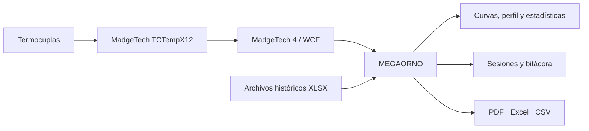

<div align="center">

# MEGAORNO

### Sistema de adquisición y supervisión de tratamientos térmicos industriales

**Instrumentación · Análisis térmico · Desarrollo de software · Automatización industrial**


**[Versiones](CHANGELOG.md) · [Documentación técnica](docs/README_TECNICO_COMPLETO.md) · [Fotografías y capturas](docs/img/)**

</div>

<!-- FOTO 01: Horno completo con fondo transparente.
Subir docs/img/01-horno-completo.png y reemplazar este comentario por:

-->

## Descripción general

**MEGAORNO** es una aplicación de escritorio desarrollada para adquirir, visualizar y analizar temperaturas durante tratamientos térmicos en un horno industrial de gran escala del **Astillero Río Santiago**, dentro de las tareas de Investigación y Desarrollo.

El sistema conecta el instrumental **MadgeTech** con una interfaz orientada al operador, registra las mediciones de termocuplas, calcula el **gradiente temporal** de calentamiento y enfriamiento y compara el comportamiento medido con un **perfil ideal**. Permite conservar cada tratamiento y generar informes en **PDF, Excel y CSV**.

El proyecto surge de la necesidad de reemplazar un seguimiento basado en software del fabricante y planillas con fórmulas rígidas por una herramienta integrada, intuitiva y reproducible. **La supervisión y el análisis están desarrollados; el control automático de quemadores es una etapa futura.**

## El horno y su aplicación

Se trata de un horno industrial de grandes dimensiones, equipado con varios quemadores, una instalación de gas, actuadores y zonas de medición térmica. Su potencial reside en ejecutar ciclos controlados sobre piezas metálicas de gran tamaño, con aplicaciones de calentamiento y tratamientos térmicos según las necesidades y procedimientos de producción.

En estos procesos no importa únicamente alcanzar una temperatura máxima. La **velocidad de ascenso, el tiempo de mantenimiento, la uniformidad espacial y el enfriamiento** influyen en el comportamiento del material, las tensiones térmicas y la repetibilidad del tratamiento. MEGAORNO permite registrar y evaluar esa evolución sin depender de cálculos manuales posteriores.

<!-- FOTO 02: Lateral del horno, quemadores y actuadores.
Subir docs/img/02-horno-quemadores.jpg

-->

## Origen y relevamiento de requerimientos

La etapa inicial incluyó el análisis de la operatoria existente y el **relevamiento de necesidades mediante conversaciones y entrevistas con el personal que utiliza el horno**. El objetivo fue comprender el seguimiento real de un tratamiento, las anotaciones de los operadores y las dificultades para interpretar curvas y reconstruir el historial de una corrida.

Se revisaron registros exportados por MadgeTech y una planilla histórica de tratamiento térmico. Entre los problemas identificados estaban las referencias externas rotas, canales vacíos, rangos fijos y una fórmula de velocidad que suponía muestras espaciadas exactamente cinco minutos. A partir de ello se priorizaron la lectura por canal, la comparación con una receta configurable, la trazabilidad y la generación automática de informes.

## Arquitectura y adquisición



La interfaz está desarrollada con **Python y PySide6/Qt**, y las gráficas utilizan **Matplotlib**. El acceso a las lecturas del fabricante se realiza mediante un puente **C#/.NET Framework 4.8** que consulta el servicio WCF local de MadgeTech 4. La información se procesa y conserva mediante los módulos Python de adquisición, modelos y reportes.

El equipo dispone de **12 entradas de termocupla** y valores asociados de temperatura ambiente. Las respuestas WCF documentadas presentan 24 posiciones alternadas. MEGAORNO mantiene los identificadores originales y permite emplear nombres visibles para los sensores. También admite históricos XLSX y sesiones anteriores sin conexión al hardware.

<!-- FOTO 03: MadgeTech, termocuplas y conexión al sistema.
Subir docs/img/03-adquisicion-madgetech.jpg

-->

### Gradiente térmico y calidad del tratamiento

El gradiente temporal expresa cuánto cambia la temperatura por unidad de tiempo:

\[
g_t=\frac{\Delta T}{\Delta t}, \qquad
g_{\mathrm{°C/h}}=3600\frac{T_n-T_{n-1}}{t_n-t_{n-1}}
\]

Aquí, las temperaturas se expresan en °C y los tiempos en segundos. El signo distingue el calentamiento del enfriamiento. **Se utiliza el intervalo real entre mediciones**, no un factor fijo: con un muestreo de 15 segundos no corresponde aplicar el multiplicador usado anteriormente para cinco minutos.

La comparación con el **perfil ideal** contempla una rampa de ascenso, mantenimiento a temperatura objetivo y descenso. Durante el mantenimiento se evalúa la permanencia en una banda configurable. Las velocidades excesivas, las salidas de banda o las interrupciones de lectura pueden señalar desviaciones que requieren revisión del personal técnico.

Conviene distinguir el gradiente temporal **dT/dt** del gradiente espacial **dT/dx**, que describe diferencias de temperatura entre posiciones del horno o de una pieza. Los datos de varias termocuplas permiten comparar zonas, pero no reconstruir automáticamente el campo térmico completo.

Una lectura inválida, un hueco prolongado o una pausa **interrumpe el cálculo**: no se inventan temperaturas ni se unen mediciones separadas por períodos sin adquisición. Las condiciones admisibles dependen del material, la geometría y el procedimiento aplicable; el software no certifica por sí solo la conformidad metalúrgica.

## Interfaz y funcionalidades

La aplicación presenta una pantalla de inicio y **cinco pestañas principales**, organizadas para consultar el proceso sin trabajar directamente sobre planillas.

| Vista | Función |
| --- | --- |
| **Inicio** | Cargar un ejemplo, abrir registros o configurar y conectar MadgeTech. |
| **Curvas** | Graficar temperatura, gradiente o ambas; seleccionar sensores, ampliar e inspeccionar puntos. |
| **Perfil ideal** | Definir temperaturas, rampas, mantenimiento, tolerancias y desfase temporal. |
| **Estadísticas** | Consultar máximos, mínimos, fechas, gradientes extremos y permanencia en banda. |
| **Datos** | Revisar todas las muestras, guardar la sesión y registrar anotaciones de operación en la bitácora. |
| **Avisos** | Consultar desviaciones, problemas de lectura y diagnósticos de conexión. |

<!-- FOTO 04: Captura de Inicio, docs/img/04-inicio.png -->
<!-- FOTO 05: Captura de Curvas, docs/img/05-curvas.png -->
<!-- FOTO 06: Captura de Perfil ideal, docs/img/06-perfil-ideal.png -->
<!-- FOTO 07: Captura de Estadísticas, docs/img/07-estadisticas.png -->
<!-- FOTO 08: Captura de Datos y bitácora, docs/img/08-datos.png -->
<!-- FOTO 09: Captura de Avisos, docs/img/09-avisos.png -->

El gráfico permite explorar distintas ventanas de tiempo, hacer zoom por eje, desplazar la vista y consultar valores registrados. En la versión 3.2, **Pausa/Reanudar** detiene temporalmente la recepción de MEGAORNO sin eliminar el historial ni cerrar la sesión. La adquisición interna del registrador MadgeTech continúa de forma independiente.

## Sesiones, exportación e informes

Las mediciones se almacenan junto con su fecha, identidad de canal, perfil y anotaciones en sesiones **`.horno.json`**. El guardado conserva los datos de origen y permite reabrir tratamientos para su análisis.

| Formato | Uso principal |
| --- | --- |
| **PDF** | Informe automático con curvas, receta, estadísticas, eventos y resultados. |
| **Excel (.xlsx)** | Análisis tabular y gráfico editable, sin depender de macros ni referencias externas. |
| **CSV** | Intercambio de mediciones con otras herramientas, incluyendo temperatura y gradientes. |

El informe PDF representa las curvas de los canales seleccionados al exportar, mientras que sus tablas mantienen el registro completo. El proceso de exportación permite documentar y comparar tratamientos sin reconstruir manualmente fórmulas y gráficos.

<!-- FOTO 10: Informe generado, docs/img/10-informe-pdf.png -->

## Evolución del proyecto

| Versión | Avance principal |
| --- | --- |
| **3.0** | Nueva interfaz Qt, integración de adquisición, perfiles, gráficos, estadísticas y exportaciones. |
| **3.1** | Mejoras de experiencia de usuario, avisos, identificación de sensores y selección para PDF. |
| **3.2** | Pausa/reanudación, cortes de adquisición persistentes, mejoras de cursor y zoom y unificación de gradientes. |

El código de cada entrega se encuentra disponible por separado en las ramas [v3.0](https://github.com/BaltazarPatane/MEGAORNO/tree/version/v3.0), [v3.1](https://github.com/BaltazarPatane/MEGAORNO/tree/version/v3.1) y [v3.2](https://github.com/BaltazarPatane/MEGAORNO/tree/version/v3.2). Consultá el [historial detallado](CHANGELOG.md) para conocer las mejoras y compatibilidades entre versiones.

## Instalación y ejecución

**Requisitos para adquisición real:** Windows, Python 3.11–3.14 (64 bits), .NET Framework 4.8 y MadgeTech 4 instalado con sus bibliotecas de comunicación. Se recomienda Python 3.12.

1. Clonar el repositorio o descargar el código de `main`.
2. Ejecutar **`Iniciar.bat`**. En el primer inicio crea el entorno virtual e instala las dependencias fijadas en `requirements.lock`.
3. Elegir **Cargar ejemplo** para explorar una corrida sin instrumental, **Abrir archivo** para recuperar un histórico o **Conectar con MadgeTech** para recibir datos actuales.
4. Para adquisición real, abrir antes MadgeTech 4, iniciar el registro y configurar la conexión WCF desde Inicio.

También es posible ejecutar la aplicación desde un entorno Python preparado:

```powershell
py -3.12 -m venv .venv
.venv\Scripts\python -m pip install --require-hashes -r requirements.lock
.venv\Scripts\python app.py
```

El ejemplo y el análisis de históricos pueden utilizarse sin el puente WCF de Windows. El funcionamiento sobre hardware real debe comprobarse con el instrumento, los sensores y las condiciones específicas de la instalación.

## Validación y próximos pasos

La versión 3.2 cuenta con **115 pruebas automatizadas de Python/Qt aprobadas**, además de verificaciones del puente C# mediante datos simulados. Están documentadas en [VALIDACION.md](docs/VALIDACION.md). Estas pruebas no sustituyen una validación metrológica ni un ensayo completo sobre el horno.

Las próximas etapas del proyecto contemplan:

- Verificar de extremo a extremo la adquisición y el mapeo físico de cada termocupla durante tratamientos reales prolongados.
- Integrar mediciones y avisos con criterios de aceptación establecidos para cada receta.
- Incorporar el **control automático de los actuadores de gas** mediante hardware industrial adecuado, con estudio de salidas analógicas (por ejemplo, 4–20 mA) y ajuste de control PI/PID.
- Implementar enclavamientos, límites y protecciones independientes de la aplicación, además de ensayar los lazos de control antes de cualquier operación automática.
- Mejorar la comparación de tratamientos y la trazabilidad de resultados históricos.

**MEGAORNO es actualmente una herramienta de supervisión y análisis. No reemplaza los sistemas de seguridad, los procedimientos de operación ni la evaluación técnica de conformidad de los tratamientos.**

---

### Documentación y recursos

- [Documentación técnica completa](docs/README_TECNICO_COMPLETO.md) — desarrollo, decisiones de diseño y fundamentaciones ampliadas.
- [Arquitectura de software](docs/ARQUITECTURA.md) — módulos, comunicación y persistencia.
- [Historial de versiones](CHANGELOG.md) — cambios y política de ramas.
- [Pruebas y validación](docs/VALIDACION.md) — alcance de los ensayos.
- [Carpeta de imágenes](docs/img/) — espacio reservado para fotografías y capturas de pantalla.

<div align="center">

**MEGAORNO · Investigación y Desarrollo · Astillero Río Santiago**

</div>
